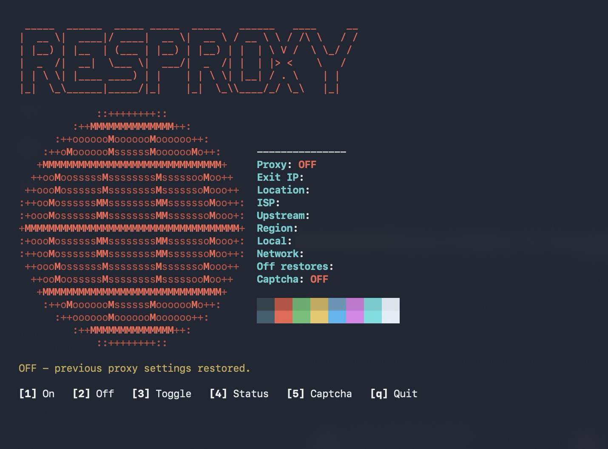

# resproxy


Put your computer on a residential proxy with one key. Turn it off and
whatever proxy you had before comes right back.



## What it does

Most apps can't sign in to a proxy that needs a username and password.
resproxy runs a small local forwarder that adds your login for you, then points
your system proxy at it. Browsers and most apps go through your residential IP
without any setup of their own.

It can also solve captchas for your own Python scripts through 2captcha.

Needs Python 3.8 or newer, nothing else to install. Works on macOS today.
Windows and Linux support is in testing. On Linux it switches the proxy on
desktops that use GNOME settings (GNOME, Ubuntu, Cinnamon, Budgie, Pantheon).

## Setup

```sh
git clone https://github.com/ard37880/resproxy.git
cd resproxy
cp config.example.json config.json
```

On Windows, use `copy` instead of `cp`.

Open `config.json` and fill in your details:

```json
{
  "upstream_host": "your proxy host",
  "upstream_port": 2334,
  "username": "your proxy username",
  "password": "your proxy password",
  "local_port": 8899,
  "services": [],
  "captcha_api_key": "your 2captcha API key (optional)"
}
```

I recommend [2captcha](https://2captcha.com) for both, so everything is in
one account:

- **Proxy details:** the residential proxy section of your 2captcha dashboard.
  Copy the host, the HTTP port, username and password.
- **API key:** shown in your 2captcha account. Only needed if you want captcha
  solving.

Any other provider that gives you an HTTP proxy with a username and password
works too. Leave `local_port` and `services` as they are. `services` is only
used on macOS, to pick network services by name, like `["Wi-Fi"]`. Empty means
whichever one you're on.

`config.json` is gitignored, so your login stays on your machine.

## Usage

```sh
python3 proxy
```

On Windows, run `py proxy` instead.

| Key | |
|---|---|
| `1` | Proxy on |
| `2` | Proxy off |
| `3` | Toggle |
| `4` | Refresh status |
| `5` | Captcha solving on/off |
| `q` | Quit |

Want to just type `proxy`? Add this to `~/.zshrc` (or `~/.bashrc` on Linux):

```sh
alias proxy="python3 ~/resproxy/proxy"
```

On Windows, PowerShell doesn't run profile scripts until you allow it, and
the profile file may not exist yet. Run this once:

```powershell
Set-ExecutionPolicy -Scope CurrentUser RemoteSigned -Force
```

then this, which opens the profile in Notepad:

```powershell
if (!(Test-Path $PROFILE)) { New-Item -Force -ItemType File $PROFILE }
notepad $PROFILE
```

In Notepad, add this line, save, and open a new PowerShell window:

```powershell
function proxy { py "$HOME\resproxy\proxy" }
```

(change the path to wherever you cloned it)

No dashboard needed? `python3 resproxy.py on`, `off` and `status` (`py` instead
of `python3` on Windows) do the same from any terminal.

Prefer a menu bar switch? (macOS only) Run `./build-app.sh`, then
`open ResProxy.app`. Building it needs the Xcode Command Line Tools
(`xcode-select --install`).

## Captcha solving

For your own scripts:

```python
import sys; sys.path.insert(0, "/path/to/resproxy")
import solver

token = solver.recaptcha_v2(site_key, page_url)
token = solver.turnstile(site_key, page_url)
```

The site key is in the page source (search for `sitekey`). Solves only happen
while key `5` is on, so a script won't spend your balance by accident.

## Q&A

**It says BROKEN. What do I do?**
Press `2`. BROKEN means your system is still pointed at the proxy but the
forwarder isn't running, usually because you restarted with it on. Websites
won't load until you fix it. `2` puts your old settings back, `1` starts the
proxy again.

**It says PARTIAL.**
The proxy is running, but the network you're on now isn't pointed at it. On a
Mac that usually means you moved from Wi-Fi to a cable. Press `1` to switch it
too.

**It says UNFINISHED.**
An off didn't get all the way through, or the forwarder is still running with
nothing pointed at it. Press `2` to finish it.

**It says UNKNOWN.**
It can't read your proxy settings from where it's running, usually a Linux
shell over ssh or in tmux without your desktop session. Run it from a terminal
on the desktop instead.

**Will this mess with my other proxy settings?**
No. Whatever was set before you turned it on gets saved and restored when you
turn it off.

**Is my proxy login safe on public Wi-Fi?**
It goes to your provider as plain HTTP proxy auth, so someone on the same
network could see it. Use a VPN or a provider with TLS if that matters to you.

**Does everything go through the proxy?**
Browsers and most apps do. Terminal tools like `curl` and `git` ignore the
system proxy, and video calls and games won't go through it. On Windows, some
services and command line tools use a separate setting (WinHTTP) that this
doesn't change.

**I'm on Linux with KDE, Xfce or no desktop.**
Those keep their proxy settings somewhere else, so `on` stops and tells you
what to do instead: run `python3 resproxy.py serve` and keep it open, then
point apps at `http://127.0.0.1:8899`, for example with
`export http_proxy=http://127.0.0.1:8899 https_proxy=http://127.0.0.1:8899`.
Press Ctrl-C in that window to stop it.

**A very slow download got cut off.**
Known limit: if an app has finished sending and then reads its download very
slowly (a few KB a second), the connection can be cut after 45 seconds even
though data is still coming in. And a misbehaving server that sends endless
headers to an app that has stopped reading can keep that one connection open
until you turn the proxy off.

**My IP keeps changing.**
That's normal for rotating residential proxies. Most providers give you a new
IP per connection.

**Does turning captcha on solve captchas in my browser?**
No. It only lets your scripts call `solver.py`. For the browser, use
2captcha's browser extension.

**How do I get rid of it?**
Press `2` first so your settings are restored, then delete the folder and the
small one it keeps its state in:

- macOS: `~/Library/Application Support/resproxy`
- Windows: `%APPDATA%\resproxy`
- Linux: `~/.local/state/resproxy`
